# Hospital Management System (HMS)

## 📋 Project Overview

A comprehensive Hospital Management System built with React, Node.js, Express, and MongoDB. This system manages all hospital operations including patient registration, doctor appointments, lab tests, X-ray services, pharmacy management, and administrative functions.

## 📸 Screenshots

### **1. Persona Page**

*Secure login with role selection*

### **2. SignUp Page**

*Secure login with role selection*

### **3. Login Page**

*Secure login with role selection*

### **4. Admin Dashboard**
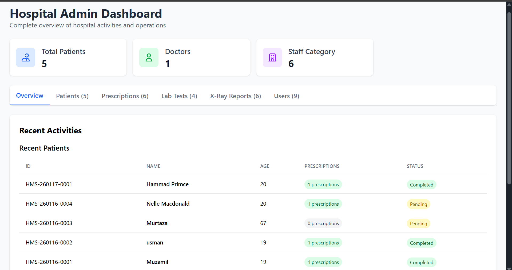
*Complete system overview with statistics*

### **5. Profile Page**
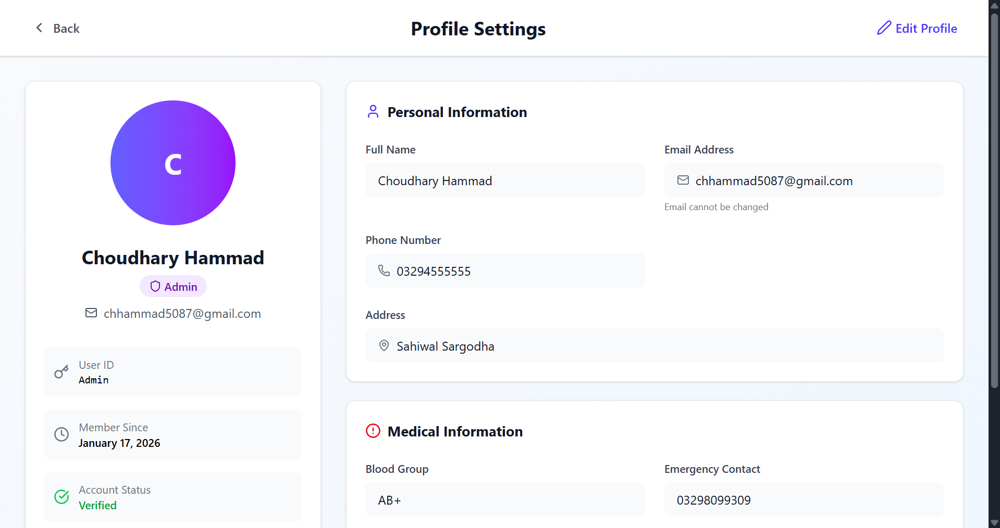
*User profile management*

### **6. Reception Dashboard**
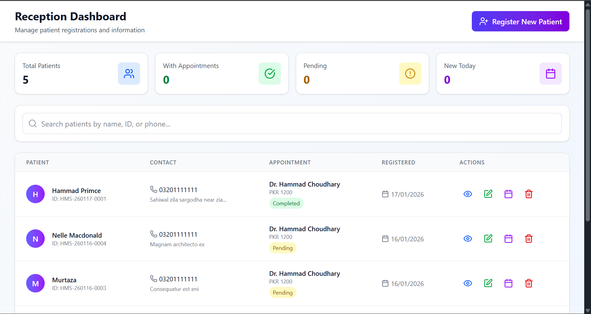
*Patient registration form with automatic ID generation*

### **7. Patient Appointment**
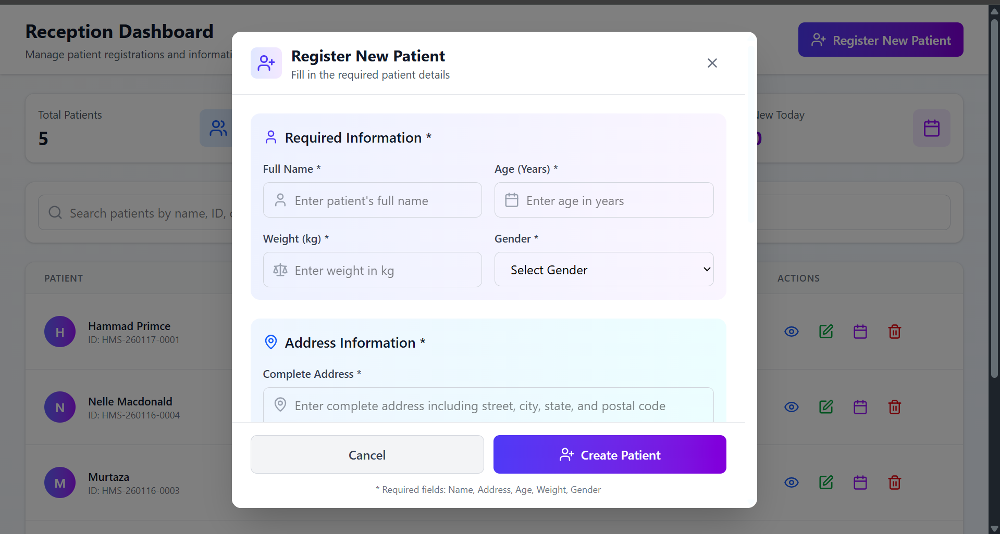
*Patient appointment and registration management*

### **8. Doctor Dashboard**
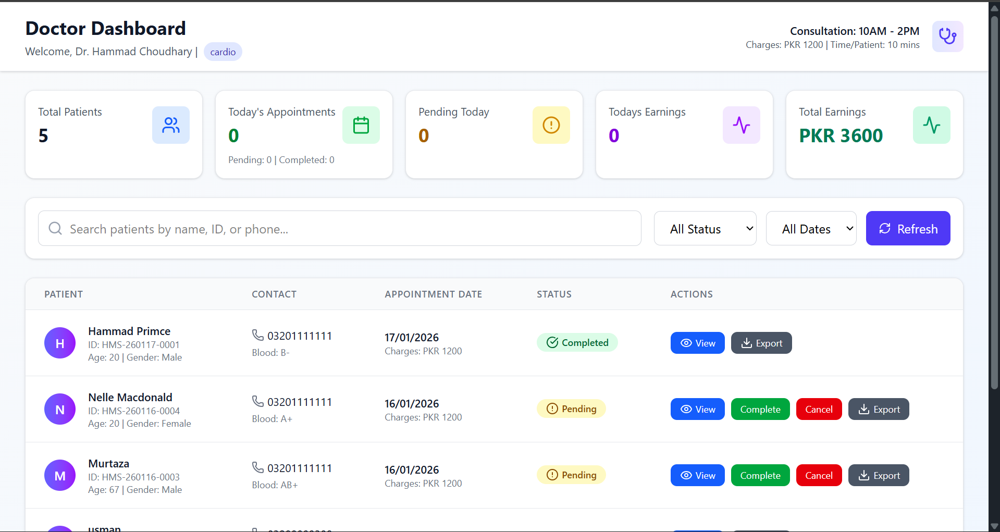
*Doctor interface with patient list and appointments*

### **9. Laboratory Module**
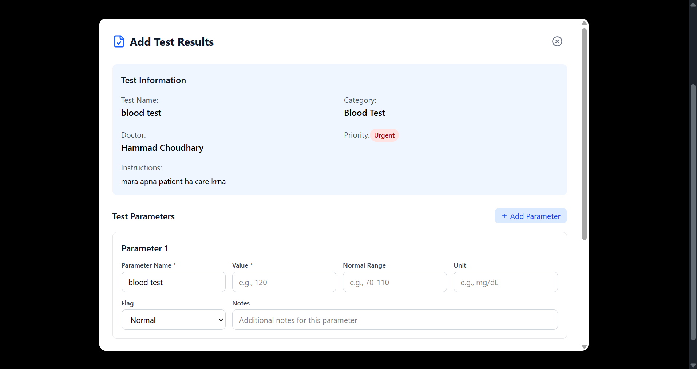
*Lab test management with parameter entry*

### **10. Laboratory Dashboard**
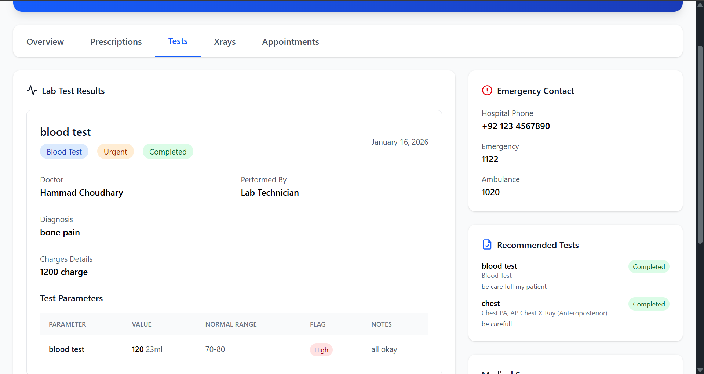
*Laboratory test processing dashboard*

### **11. Laboratory Records**
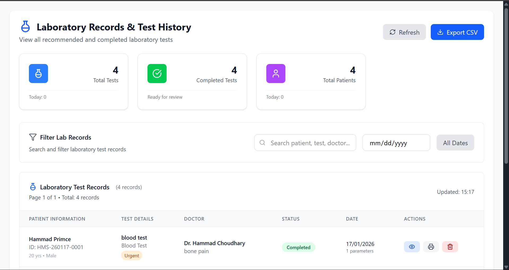
*Laboratory records and reports*

### **12. X-Ray Dashboard**
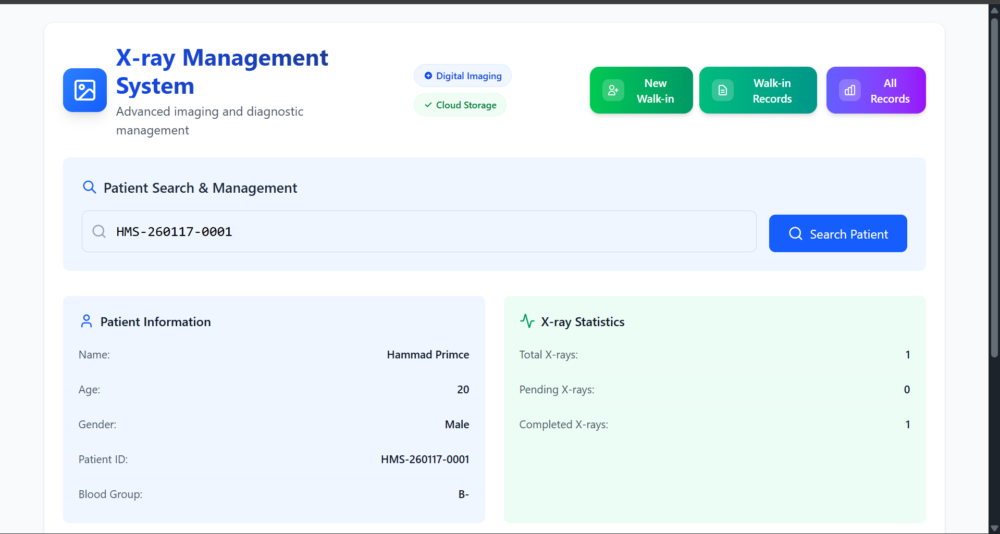
*X-Ray test management with image upload*

### **13. X-Ray Module**
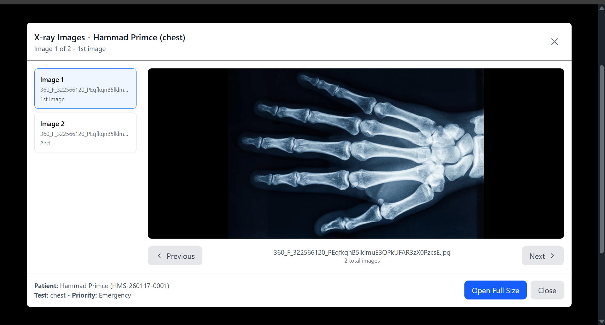
*X-Ray examination and report generation*

### **14. Pharmacy Dashboard**
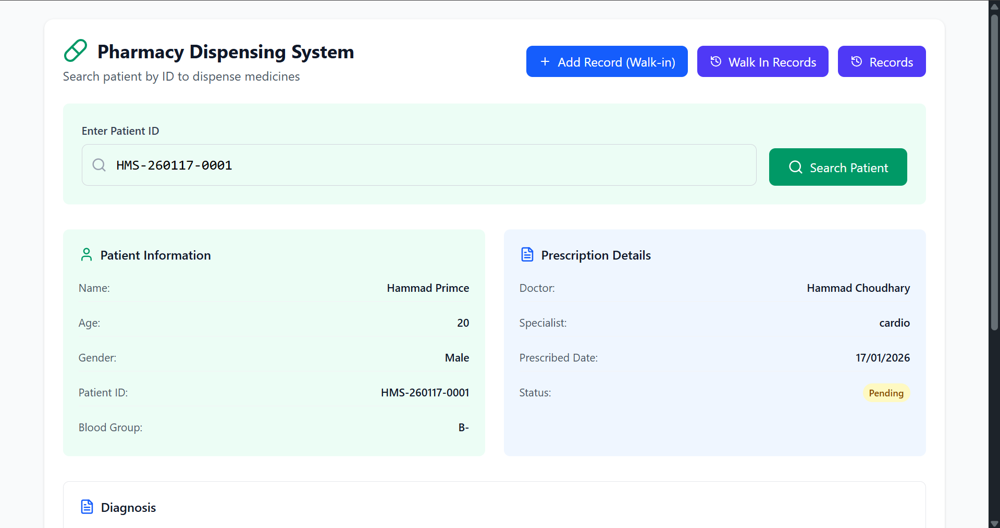
*Medicine dispensing and inventory management*

### **15. Pharmacy Module**
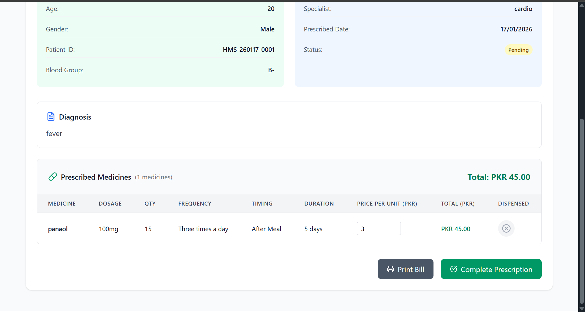
*Pharmacy medicine management*

### **16. Pharmacy Records**
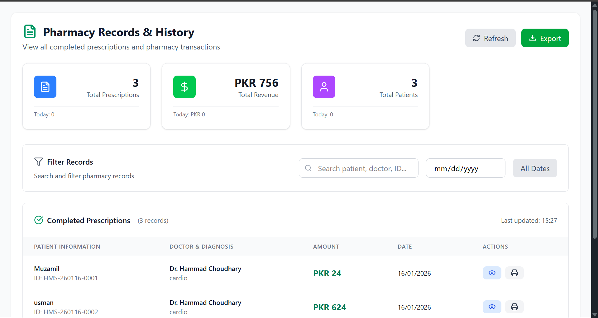
*Pharmacy transaction records*

### **17. Reports Dashboard**
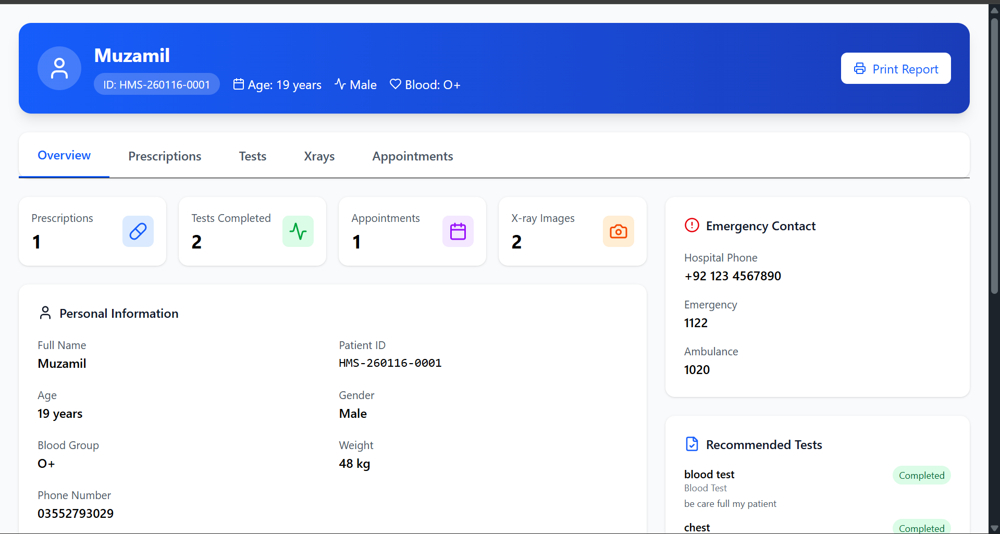
*Printable reports and patient records*


## 🏥 System Features

### **1. User Management**
- Role-based authentication (Admin, Doctor, Reception, Lab Technician, X-Ray Technician, Pharmacy, Patient)
- User registration and profile management
- Role-specific dashboards

### **2. Patient Management**
- Patient registration with unique ID generation
- Medical history and records
- Appointment scheduling
- Prescription management

### **3. Doctor Module**
- Appointment scheduling and management
- Patient diagnosis and treatment plans
- Prescription writing
- Test recommendations

### **4. Laboratory Module**
- Lab test requests and processing
- Test result entry and management
- Multiple parameter test support
- Report generation and printing

### **5. X-Ray Module**
- X-Ray test requests
- Image upload and management
- Walk-in patient support
- Report generation

### **6. Pharmacy Module**
- Prescription dispensing
- Medicine inventory management
- Walk-in pharmacy sales
- Bill generation

### **7. Admin Dashboard**
- Complete system overview
- Activity monitoring
- User management
- System statistics and reports

## 🚀 Tech Stack

### **Frontend:**
- React 18
- Tailwind CSS
- Lucide React Icons
- React Router DOM
- Zustand (State Management)

### **Backend:**
- Node.js
- Express.js
- MongoDB (Mongoose ODM)
- JWT Authentication
- Cloudinary (Image Storage)

### **Key Libraries:**
- `bcryptjs` for password hashing
- `jsonwebtoken` for authentication
- `multer` for file uploads
- `cloudinary` for cloud storage
- `axios` for HTTP requests

## 📁 Project Structure

```
hospital-management-system/
├── client/                 # Frontend React Application
│   ├── src/
│   │   ├── components/    # Reusable UI components
│   │   ├── pages/         # Page components
│   │   ├── store/         # Zustand stores
│   │   ├── services/      # API services
│   │   └── utils/         # Utility functions
│   ├── public/            # Static files
│   └── package.json
│
├── server/                # Backend Node.js Application
│   ├── models/           # MongoDB schemas
│   ├── controllers/      # Route controllers
│   ├── routes/           # API routes
│   ├── middleware/       # Auth middleware
│   ├── config/           # Configuration files
│   └── server.js
│
└── README.md
```

## 🔐 Authentication & Authorization

### **User Roles:**
1. **Admin** - Full system access
2. **Doctor** - Patient management, prescriptions, tests
3. **Reception** - Patient registration, appointments
4. **Lab Technician** - Lab tests and results
5. **X-Ray Technician** - X-Ray tests and reports
6. **Pharmacy** - Medicine dispensing
7. **Patient** - Personal records and appointments

### **Protected Routes:**
- Role-based route protection
- JWT token authentication
- Session management

## 📊 Database Schema

### **Main Collections:**
1. **Users** - All system users
2. **Patients** - Patient information
3. **Prescriptions** - Medicine prescriptions
4. **LabRecords** - Laboratory test results
5. **XRayRecords** - X-Ray test results
6. **Appointments** - Doctor appointments

## 🎨 UI/UX Features

### **Design System:**
- Responsive design (Mobile, Tablet, Desktop)
- Consistent color scheme
- Intuitive navigation
- Real-time notifications
- Loading states and error handling

### **Key UI Components:**
- Dashboard cards and statistics
- Data tables with pagination
- Modal forms for data entry
- Print-friendly reports
- Search and filter functionality


## 🛠️ Installation & Setup

### **Prerequisites:**
- Node.js (v16 or higher)
- MongoDB (v4.4 or higher)
- npm or yarn

### **Backend Setup:**
```bash
cd server
npm install
```

Create `.env` file in server directory:
```env
PORT=5000
MONGODB_URI=mongodb://localhost:27017/hms
JWT_SECRET=your_jwt_secret_key
CLOUDINARY_CLOUD_NAME=your_cloud_name
CLOUDINARY_API_KEY=your_api_key
CLOUDINARY_API_SECRET=your_api_secret
```

Start backend server:
```bash
npm start
# or for development
npm run dev
```

### **Frontend Setup:**
```bash
cd client
npm install
```

Create `.env` file in client directory:
```env
REACT_APP_API_URL=http://localhost:5000/api
```

Start frontend development server:
```bash
npm start
```


## 📱 API Endpoints

### **Authentication:**
- `POST /api/auth/register` - User registration
- `POST /api/auth/login` - User login
- `POST /api/auth/logout` - User logout

### **Patients:**
- `GET /api/patients` - Get all patients
- `POST /api/patients` - Create new patient
- `GET /api/patients/:id` - Get patient by ID
- `PUT /api/patients/:id` - Update patient

### **Appointments:**
- `GET /api/appointments` - Get all appointments
- `POST /api/appointments` - Create appointment
- `PUT /api/appointments/:id` - Update appointment status

### **Laboratory:**
- `GET /api/lab` - Get all lab records
- `POST /api/lab` - Create lab record
- `GET /api/lab/statistics` - Get lab statistics

### **X-Ray:**
- `GET /api/xray` - Get all X-Ray records
- `POST /api/xray` - Create X-Ray record
- `POST /api/xray/walkin` - Create walk-in X-Ray

### **Pharmacy:**
- `GET /api/pharmacy` - Get all prescriptions
- `POST /api/pharmacy` - Create prescription
- `POST /api/pharmacy/walkin` - Create walk-in prescription

## 🔧 Deployment

### **Backend Deployment:**
```bash
# Build for production
npm run build

# Start production server
npm start
```

### **Frontend Deployment:**
```bash
# Build React app
npm run build

# Serve static files
serve -s build
```

## 📈 Future Enhancements

### **Planned Features:**
1. **Telemedicine Integration** - Video consultations
2. **Inventory Management** - Advanced stock tracking
3. **Billing System** - Automated billing and payments
4. **Mobile App** - React Native application
5. **AI Integration** - Disease prediction and diagnosis assistance
6. **Analytics Dashboard** - Advanced data visualization
7. **SMS/Email Notifications** - Appointment reminders
8. **Multi-language Support** - Internationalization

### **Technical Improvements:**
1. **Microservices Architecture** - Scalable backend
2. **Redis Caching** - Improved performance
3. **WebSocket** - Real-time updates
4. **Docker Containerization** - Easy deployment
5. **CI/CD Pipeline** - Automated testing and deployment
6. **API Documentation** - Swagger/OpenAPI

## 🐛 Troubleshooting

### **Common Issues:**

1. **MongoDB Connection Error:**
   - Ensure MongoDB is running
   - Check connection string in .env file
   - Verify network connectivity

2. **CORS Errors:**
   - Check backend CORS configuration
   - Verify frontend API URL
   - Ensure proper headers are set

3. **Image Upload Issues:**
   - Check Cloudinary configuration
   - Verify file size limits
   - Check file format support

4. **Authentication Problems:**
   - Clear browser cookies
   - Check JWT token expiration
   - Verify user role permissions

## 🤝 Contributing

1. Fork the repository
2. Create a feature branch
3. Commit your changes
4. Push to the branch
5. Open a Pull Request

## 📄 License

This project is licensed under the MIT License - see the LICENSE file for details.

## 🙏 Acknowledgments

- Icons by [Lucide React](https://lucide.dev/)
- UI Components by [Tailwind CSS](https://tailwindcss.com/)
- Database by [MongoDB](https://www.mongodb.com/)
- Cloud Storage by [Cloudinary](https://cloudinary.com/)

## 📞 Support

For support, email: hammadp5087@gmail.com

---

**Note:** This is a demonstration project for educational purposes. Not intended for production use without proper security and compliance measures.
